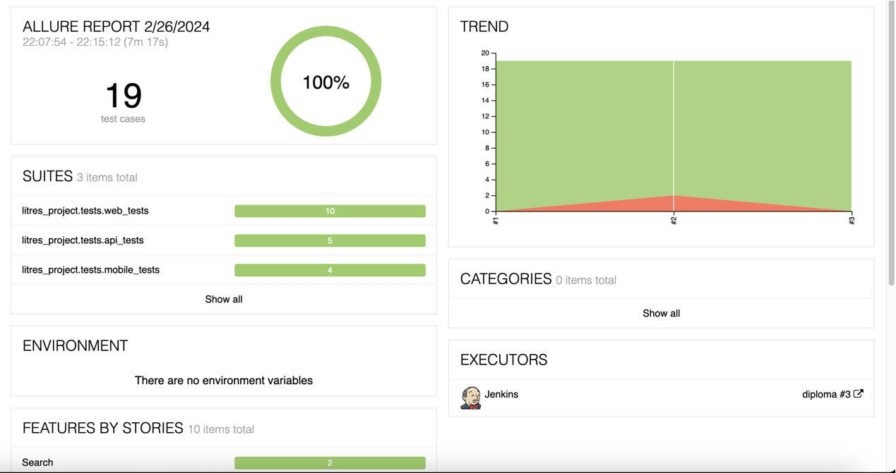
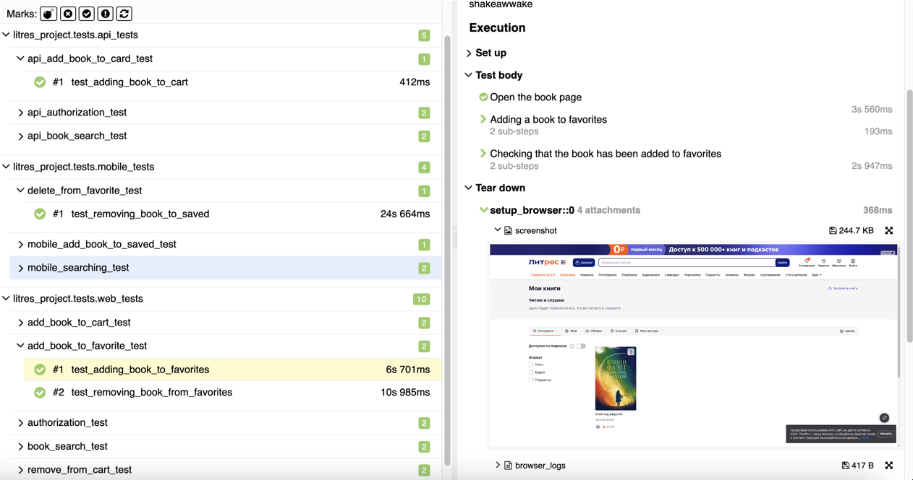
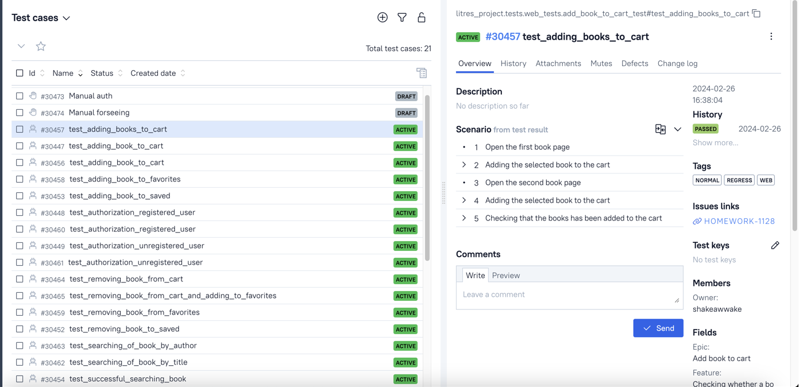
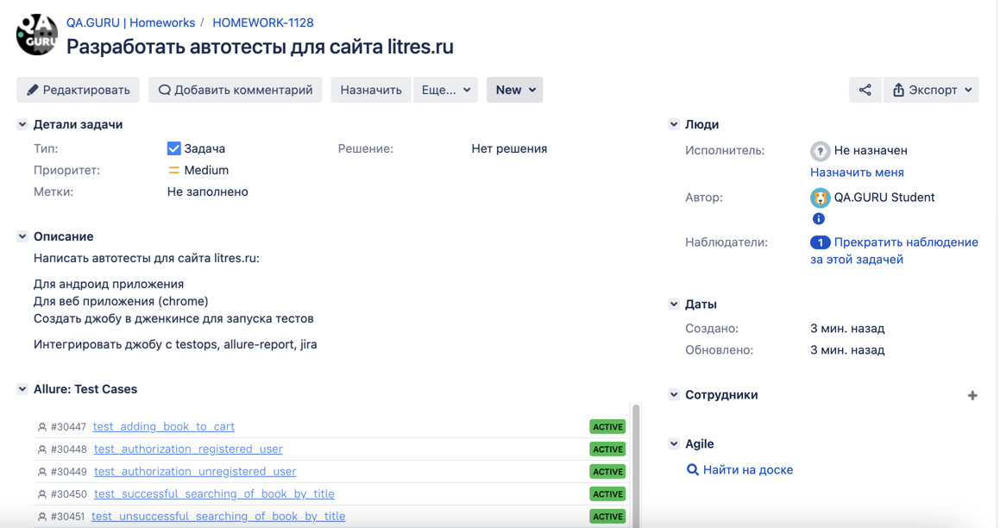
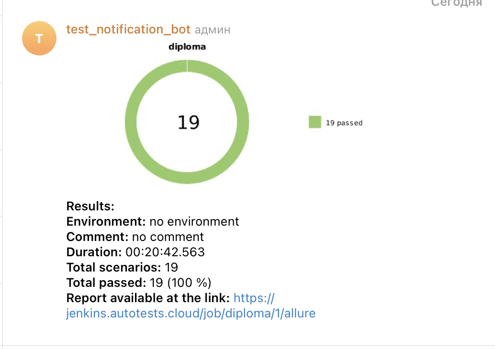

<h1> Проект по тестированию сервиса электронных и аудиокниг "Литрес"</h1>

> <a target="_blank" href="https://www.litres.ru">Ссылка на сайт</a>


<h3> Список проверок, реализованных в автотестах:</h3>

### UI-тесты

- [x] Авторизация пользователя на сайте(успешная и неуспешная)
- [x] Поиск книги
- [x] Добавление книги в корзину
- [x] Удаление книги из корзины
- [x] Добавление книги в Избранное
- [x] Удаление книги из Избранного

### API-тесты

- [x] Авторизация пользователя на сайте(успешная и неуспешная)
- [x] Поиск книги(успешный и неуспешный)
- [x] Добавление книги в корзину

### Mobile-тесты

- [x] Поиск книги(успешный и неуспешный)
- [x] Добавление книги в Сохраненное
- [x] Удаление книги из Сохраненного

----

### Проект реализован с использованием:

         

----

### Локальный запуск

1. Клонируйте репозиторий на свой локальный компьютер при помощи git clone
2. Создайте и активируйте виртуальное окружение

  ```bash
  python -m venv .venv
  source .venv/bin/activate
  ```

3. Установите зависимости с помощью pip

  ```bash
  pip install -r requirements.txt
  ```

4. Для запусков тестов локально используйте команды:

  ```bash
  pytest -sv  litres_project/tests/mobile
  pytest -sv litres_project/tests/api
  pytest -sv litres_project/tests/ui
  ```

Получение отчёта allure:

```bash
allure serve allure-results
```

----

### Удаленный запуск автотестов выполняется на сервере Jenkins

> <a target="_blank" href="https://jenkins.autotests.cloud/job/diploma/">Ссылка на проект в Jenkins</a>

#### Для запуска автотестов в Jenkins

1. Открыть <a target="_blank" href="https://jenkins.autotests.cloud/job/diploma/">проект</a>
2. Выбрать пункт `Build now`
3. Результат запуска сборки можно посмотреть в отчёте Allure

----

### Allure отчет

#### Общие результаты



#### Список тест кейсов



----

### Интеграция с Allure TestOps

> <a target="_blank" href="https://allure.autotests.cloud/project/4083/dashboards">Ссылка на проект в
> AllureTestOps</a> (запрос доступа `admin@qa.guru`)

#### Cписок всех кейсов, имеющихся в проекте


----

### Интеграция с Jira

> <a target="_blank" href="https://jira.autotests.cloud/browse/HOMEWORK-1128">Ссылка на проект в Jira</a>



----

### Оповещение о результатах прогона тестов в Telegram



----

### Пример видео прохождения ui-автотеста


### Пример видео прохождения mobile-автотеста


